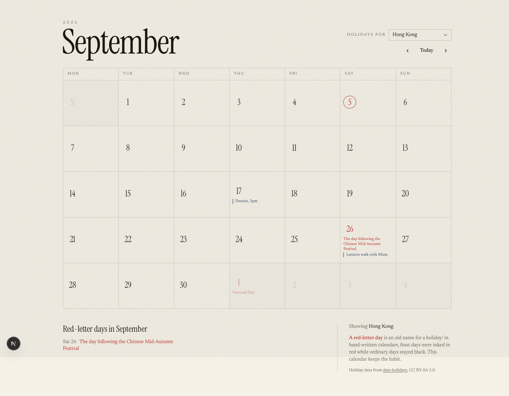

# Maintainable Vibecoding

**Build a real web app with an AI assistant, and still understand it six months later.**

This is a complete, hand-held course for someone who has never opened a
terminal. Not "never written JavaScript" — never opened a terminal. If you do
not know what a database is, what GitHub is for, or why anyone would type
commands at a computer instead of clicking, you are the person this was written
for.

By the end you will have built and published this:

A calendar that knows the public holidays of 206 countries, lets you write
appointments on days, saves them in a real database, and lives on the internet
at an address you can send to your mum. It republishes itself every time you
change the code.

---

## Start here

Open [`tutorial/01-what-youre-making.md`](tutorial/01-what-youre-making.md) and
work through in order. Chapter 3 assumes you have done chapter 2. Nothing
assumes you have done anything at all before chapter 1.

| # | Chapter | What you get out of it |
|---|---------|------------------------|
| 1 | [What you're making](tutorial/01-what-youre-making.md) | The shape of the whole thing, and what it costs |
| 2 | [The stack, and why these three](tutorial/02-the-stack-and-why.md) | Why GitHub + Vercel + Supabase, honestly |
| 3 | [Your Mac's control room](tutorial/03-your-macs-control-room.md) | Opening Terminal without fear |
| 4 | [The toolbox](tutorial/04-the-toolbox.md) | Homebrew, Node, git, Claude Code |
| 5 | [GitHub](tutorial/05-github.md) | An account, and what a repository actually is |
| 6 | [Talking to Claude Code](tutorial/06-talking-to-claude.md) | Models, effort, `ultrathink`, skills, `CLAUDE.md` |
| 7 | [Build the calendar](tutorial/07-build-the-calendar.md) | A working app on your own machine |
| 8 | [Put it on the internet](tutorial/08-vercel.md) | A real URL that updates when you push |
| 9 | [Add the holidays](tutorial/09-holidays.md) | Branches, preview links, a settings menu |
| 10 | [Add a database](tutorial/10-appointments-and-a-database.md) | Supabase, secrets, and who may read what |
| 11 | [Staying maintainable](tutorial/11-staying-maintainable.md) | The habits, collected |

Appendices: [when it breaks](tutorial/appendix-a-when-it-breaks.md) ·
[glossary](tutorial/appendix-b-glossary.md) ·
[what it costs](tutorial/appendix-c-what-it-costs.md)

---

## What "maintainable" means here

Anyone can get a working app out of an AI assistant in an afternoon. The
interesting question is what happens in week three, when you ask for one more
feature and the whole thing quietly stops working — and you cannot tell what
changed, because you did not write any of it and there is no way back.

This course teaches the app and the habits at the same time. Every habit arrives
at the moment you actually need it, never as a lecture:

| The failure | The habit that prevents it | Arrives in |
|---|---|---|
| "It worked, then I broke it and can't get back" | Commits as save points | Chapter 7 |
| "I changed one thing and the live site died" | Branch → preview link → merge | Chapter 9 |
| "The assistant forgot the rules we agreed" | `CLAUDE.md` | Chapter 6 |
| "My database password is on GitHub" | `.env.local`, and what `NEXT_PUBLIC_` means | Chapter 10 |
| "The change is 40 files and I have no idea what happened" | One feature per branch | Chapter 9 |
| "Anyone can read anyone's data" | Row Level Security — and proving it works | Chapter 10 |
| "I don't understand my own app" | Making it explain itself | Every chapter |

---

## Everything here was actually run

Every command was executed on a real Mac on 5 September 2026. Every screenshot
is of the real thing. Every version number was checked against the live package
registry rather than remembered — because the fastest way to defeat a beginner
is a command that used to work.

Three things that check caught, each of which would have stopped you dead:

- **`middleware.ts` no longer exists in Next.js.** It is `proxy.ts` now, and the
  function inside it is called `proxy`. Every tutorial older than Next.js 16
  gets this wrong.
- **Supabase keys beginning `eyJ` are the old ones**, being retired at the end of
  2026. Supabase's own documentation says: *"If a tool, tutorial, or AI
  assistant tells you to copy a long key that begins with `eyJ`, it was written
  for the legacy keys."*
- **The `think` → `think hard` → `think harder` → `ultrathink` ladder is not
  real.** Only `ultrathink` is an actual keyword. The others are ordinary words
  that do nothing at all, repeated in blog post after blog post.

The app is a separate repository so you can read the real thing, one commit per
chapter: **`my-calendar`**. Its full history is four commits, and each one is
described in the chapter that builds it.

---

## If you get stuck

Appendix A lists every error this course is known to produce, what it means, and
what to do. It is worth skimming once before you start, so that when you meet
one you remember it is in there.

Two rules that will save you more time than anything else in this file:

1. **When the assistant does something you don't understand, ask it to explain
   before you carry on.** Not later. The explanation is free and takes ten
   seconds; the confusion compounds.
2. **Commit whenever something works.** A commit is a save point. Getting back
   to a working app is then a ten-second operation instead of an evening.

---

© 2026 Albert Hui. The course text and example code are here for learning from.
Each dependency carries its own licence — check them before you ship anything
commercially, and read chapter 2 before you put ads or payments on a free
Vercel plan.
