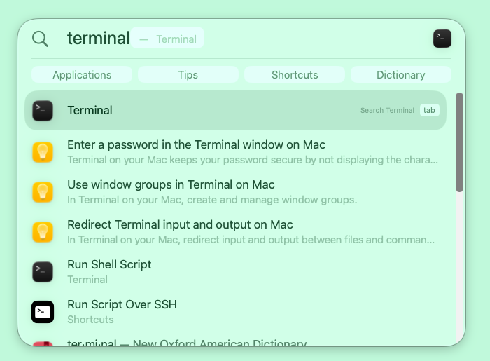
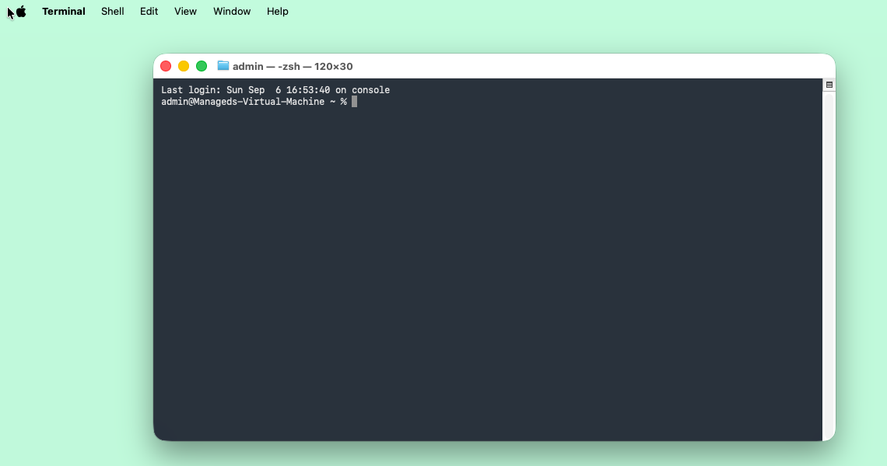
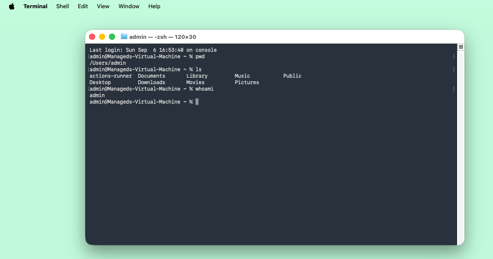

# 3. Your Mac's control room

Your Mac has a room you have probably never been in. Everything in this course
happens there, so this chapter is about getting comfortable enough to stop
noticing it.

It is called **Terminal**, and it is a window where you type instructions
instead of clicking them.

---

## Why bother, when clicking works?

Two honest reasons.

**The tools live there.** The things that turn code into a website have no
buttons. Not because their authors were unfriendly, but because a typed
instruction can be written down, shared, and repeated exactly — and a sequence
of clicks cannot.

**It is where you will talk to Claude Code.** Your AI assistant runs in this
window. You will spend far more time typing English into it than typing
commands.

---

## Opening it

Press **⌘ Space**. A search box appears in the middle of the screen — this is
Spotlight. Type `terminal`.



Terminal is the first result, with **Open** beside it. Press **Return**.



That is the whole room. A blank window with two lines of text.

Right-click Terminal in the Dock at the bottom of your screen and choose
**Options → Keep in Dock**. You will be opening it a lot.

---

## Reading the prompt

The second line is the important one:

```
admin@Manageds-Virtual-Machine ~ %
```

It looks like noise. It is four separate pieces of information:

| Piece | Means |
|---|---|
| `admin` | who you are |
| `Manageds-Virtual-Machine` | which computer |
| `~` | **which folder you are in right now** |
| `%` | "your turn, type something" |

Yours will say your own name and your own Mac's name. The parts that matter are
the last two.

**`~` means your home folder** — the one holding Desktop, Documents,
Downloads. It is shorthand, because you type it constantly.

**`%` is the cursor's way of saying it is ready.** You may see `$` instead on
some machines or in some tutorials; they mean the same thing. When you copy a
command from the internet and it starts with `$` or `%`, that symbol is *not*
part of the command. Do not type it.

---

## The single most useful thing in this chapter

**The prompt comes back when the command has finished.**

That is how you tell the difference between "it is still working" and "it is
done". Some commands finish instantly. Some take four minutes and print nothing
at all while they do. Both look identical — a window that appears frozen.

It is not frozen. **If you cannot see a `%` at the bottom with a cursor after
it, the computer is still busy.** Wait.

Beginners lose hours to this: they assume it has hung, press keys, close the
window, start again, and break something halfway through. Just watch for the
prompt.

---

## Your first three commands

Type each one and press **Return**.

```bash
pwd
```

"Print working directory" — where am I?

```bash
ls
```

"List" — what is in here?

```bash
whoami
```

Exactly what it looks like.



`pwd` answered `/Users/admin`, which is the long way of writing `~`. `ls`
listed the folders you already know from Finder — Desktop, Documents,
Downloads — because **this is the same Mac, seen from a different angle**.
Terminal is not a separate computer or a special mode. It is your own files,
described in words instead of icons.

That realisation is most of the fear gone.

---

## Four things that make it bearable

**The up arrow repeats.** Press ↑ to bring back the last command. Press it
again for the one before. You will use this constantly; nobody retypes
anything.

**Tab finishes your typing.** Type `cd Doc` then press **Tab**, and it becomes
`cd Documents/`. This is not just convenience: if Tab does *not* complete, the
thing you are typing does not exist, and you have caught a typo before running
it.

**Control-C stops.** Hold **Control** and press **C** to cancel whatever is
running. Not ⌘-C — **Control**-C. When something is running away, this is the
brake.

**Copy and paste work normally.** ⌘C and ⌘V, as everywhere else on the Mac.
Paste a command, look at it, then press Return.

---

## What you can and cannot break

You cannot break macOS by exploring. `pwd`, `ls`, `cd`, and every other
looking-around command only read. Poke about freely.

There are exactly two things to be careful of, and both are recognisable on
sight:

**`sudo`** at the start of a command means "do this as the administrator". It
will ask for your Mac password (and show nothing at all as you type it — that
is normal, not a broken keyboard). `sudo` can change anything, including things
you want kept.

**`rm`** deletes. There is no Trash and no undo. `rm -rf` deletes a whole folder
and everything inside it without asking.

Which leads to the one rule worth memorising:

> **Never paste a command you do not understand.**

If you find a command online, or an AI gives you one, and it contains `sudo` or
`rm` and you cannot say in plain English what it does — ask before running it.
Paste it to Claude Code and say:

> What does this command do? Is it safe to run on my Mac?

That is thirty seconds against an afternoon of regret, and asking is not a sign
you are out of your depth. It is the habit of people who have been doing this
for twenty years.

---

## A note on the screenshots

The pictures in this chapter come from a clean, brand-new macOS installation, so
you are seeing what a fresh machine really looks like rather than a tidied-up
version of mine. The only cosmetic change is a plain green desktop instead of
the default photograph, so that nothing competes with the window you are meant
to be looking at.

One difference to flag, because I would rather tell you than have you wonder
later: that particular machine happens to have **Node and Git already
installed** — you can see them answering in the next chapter's screenshot. A
genuinely new Mac has neither. That is exactly what chapter 4 is for.

---

## Before moving on

You should be able to open Terminal without looking up how, and you should know
what the `%` means. That is all. You do not need to memorise commands; you will
pick up the four or five that matter by using them.

---

**Next:** [4. The toolbox →](04-the-toolbox.md)
