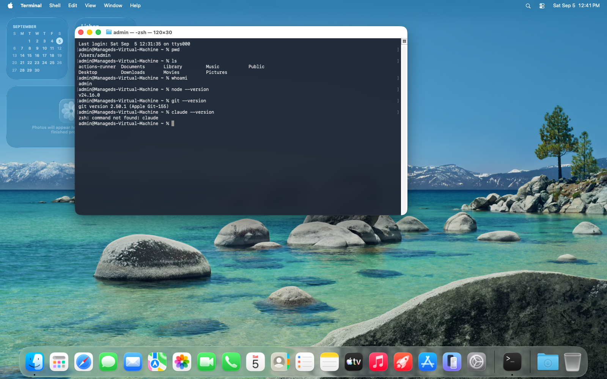

# 4. The toolbox

Three tools. This is the least enjoyable chapter in the course — installing
things always is — and it is the only one where nothing visible happens at the
end. Everything after it is immediately rewarding.

| Tool | What it is | Why you need it |
|---|---|---|
| **Git** | Keeps every version of your work | Your undo button, and how code reaches GitHub |
| **Node** | Runs JavaScript outside a browser | Every tool in this course is written in JavaScript |
| **Claude Code** | Your AI assistant, in the terminal | It writes the app |

---

## First, see what you already have

Open Terminal and run these three. Nothing here changes anything; you are just
looking.

```bash
git --version
```

```bash
node --version
```

```bash
claude --version
```



On the machine above, Git and Node answered but Claude Code did not:

```
zsh: command not found: claude
```

**`command not found` means exactly what it says** — that program is not
installed. It is not an error you have caused, and it is the single most common
message you will meet in this course. It will also appear if you mistype a
name, so read it carefully: it tells you the name it looked for.

> **A caveat about that screenshot.** It comes from a machine built for running
> automated tests, which arrives with Node and Git already on it. **A genuinely
> new Mac has neither.** If all three of your commands said `command not found`,
> you are normal and the rest of this chapter is for you. If some of them
> answered, skip those sections.

---

## Git

macOS ships a placeholder for Git that offers to install the real thing. When
you ran `git --version`, one of three things happened:

**A version number appeared** — like `git version 2.50.1 (Apple Git-155)`. You
are done. Skip ahead.

**A dialog box appeared** offering to install "command line developer tools".
Click **Install** and wait. It is a large download; make tea. When it finishes,
run `git --version` again.

**Nothing, or `command not found`** — ask for the tools directly:

```bash
xcode-select --install
```

Then click **Install** in the dialog.

> This installs Apple's developer tools, of which Git is one. It is a genuinely
> big download and the slowest step in the course. It is also the only time you
> will need it.

---

## Node

Node is the thing that runs JavaScript on your own computer rather than inside a
web page. Next.js — the framework your calendar will be built with — is
JavaScript, so nothing works without it.

**Do not install this from the terminal.** The simplest route is an ordinary
Mac installer:

1. Go to **[nodejs.org](https://nodejs.org)**
2. Download the version marked **LTS**
3. Open the downloaded `.pkg` and click through it like any other Mac app

**LTS** means "Long Term Support" — the boring, stable one. At the time of
writing that is **v24.20.0**, though it moves every few months and whichever
LTS you are offered will be fine. Next.js needs Node 20.9 or newer, and the LTS
has been well past that for a long time.

Quit Terminal completely (**⌘Q**) and open it again — a new program is only
visible to windows opened after it was installed. Then:

```bash
node --version
```

```bash
npm --version
```

You should see something like:

```
v24.18.0
12.0.1
```

**npm** arrived with Node without being asked for. It is the thing that
downloads other people's code for you, and you will see it working constantly.

---

## Claude Code

One command:

```bash
curl -fsSL https://claude.ai/install.sh | bash
```

Before you run it: this is exactly the kind of command chapter 3 told you to be
suspicious of. Here is what it says, in order — `curl` downloads a file from
`claude.ai`, and `| bash` runs it. The reason it is reasonable here is the
domain: `claude.ai` is Anthropic's own site, and this is the installation method
in their official documentation. **The domain is the thing to check.** The same
command pointed at a site you have never heard of is how people get their
laptops taken over.

Quit and reopen Terminal again, then:

```bash
claude --version
```

A version number means you are done.

### Why not `npm install` for this?

You will find plenty of pages telling you to run
`npm install -g @anthropic-ai/claude-code`. That still works, but it is no
longer the recommended route, for two reasons that matter to you:

- The npm package needs **Node 22 or newer**. The installer above needs no Node
  at all.
- The installer above **updates itself in the background**. Versions installed
  another way sit still and quietly rot, and months later you get a baffling
  error about an unsupported model with no hint that the fix is "update".

And never put `sudo` in front of an npm install. Anthropic's own documentation
warns against it.

---

## What about Homebrew?

You may have heard of Homebrew — it is how Mac developers usually install
things, and it is genuinely good.

**This course does not need it.** Installing it means first installing Apple's
developer tools and then bootstrapping Homebrew itself, which is a long detour
for no benefit here. Node has a perfectly good installer, and Claude Code has
its own.

You will want Homebrew eventually. When you do, it is at
[brew.sh](https://brew.sh), and by then you will understand what it is doing.

---

## Check the whole toolbox

```bash
git --version
```

```bash
node --version
```

```bash
npm --version
```

```bash
claude --version
```

Four version numbers, no `command not found`. That is the chapter.

If one still refuses, do not fight it — go to
[Appendix A](appendix-a-when-it-breaks.md), which has the specific failures
this step produces.

---

## One more command, now that Claude Code exists

```bash
claude update
```

Run it even though you just installed. It costs five seconds and it prevents a
class of problem that is genuinely hard to diagnose: an assistant too old to use
the model you ask for. The error when that happens is a raw
`API Error: 400 ... does not support this model`, which tells a beginner
nothing at all.

You will meet the model names in the next chapter but one.

---

**Next:** [5. GitHub →](05-github.md)
