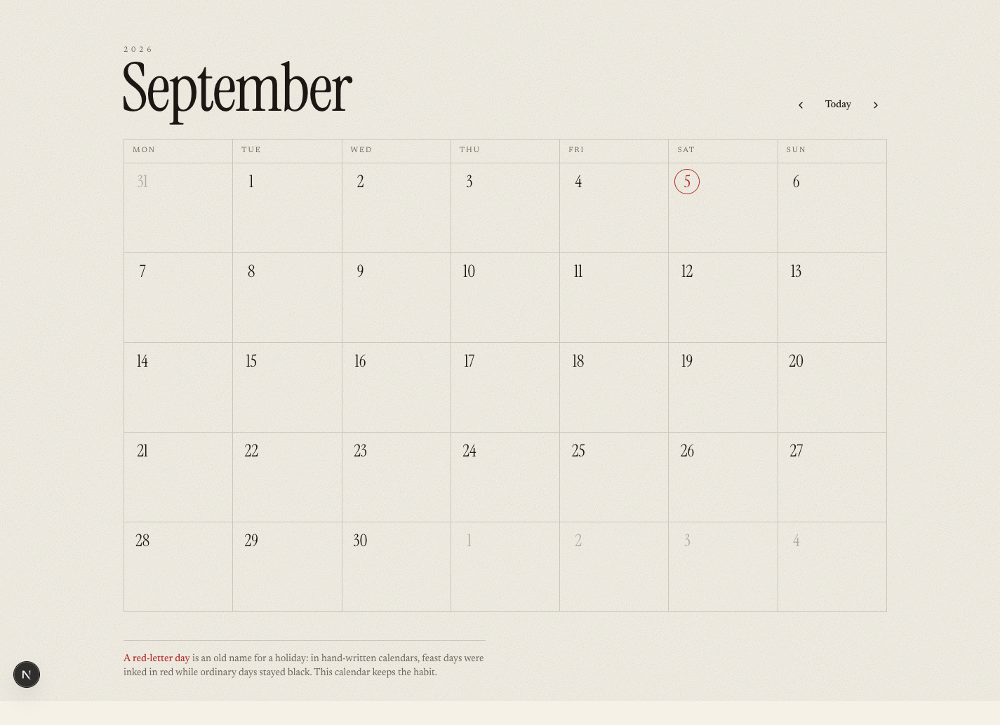

# 7. Build the calendar

Something appears on screen in this chapter.

---

## Make the project

```bash
cd ~/code
```

```bash
npx create-next-app@latest red-letter
```

`npx` runs a program without permanently installing it. `create-next-app` builds
the skeleton of a Next.js project. `red-letter` is the folder it creates.

It asks one question:

```
? Would you like to use the recommended Next.js defaults? ›
❯ Yes, use recommended defaults
    TypeScript, ESLint, No React Compiler, Tailwind CSS, No src/ directory,
    App Router, AGENTS.md
  No, customize settings
```

**Press Return.** The defaults are the right answer, and taking them means the
file paths in this course match yours exactly.

> Older tutorials show seven separate yes/no questions. That flow is gone —
> there is one menu now. If you are following two guides at once and they
> disagree, this is why.

Then it installs, and prints some alarming yellow text:

```
npm warn deprecated eslint@9.39.5: This version is no longer supported.
npm warn install-scripts 1 package had install scripts blocked because they are
npm warn install-scripts   unrs-resolver@1.12.2 (postinstall: node postinstall.js)
```

**Both are expected and neither is a problem.** The first is a warning about a
package your project depends on indirectly. The second is npm being careful:
some packages want to run a script during install, and npm now blocks that
unless you allow it. Nothing you need is affected.

Getting used to distinguishing *warnings* from *errors* is a real skill.
Warnings are notes. Errors stop things. This finished with `Success!`, so it
worked.

---

## Look at what you got

```bash
cd red-letter
```

```bash
ls
```

```
AGENTS.md    README.md    eslint.config.mjs   next.config.ts    postcss.config.mjs
CLAUDE.md    app/         next-env.d.ts       package.json      public/
                                              package-lock.json tsconfig.json
```

Two of those are worth a look right now.

```bash
cat CLAUDE.md
```

```
@AGENTS.md
```

One line. It means "also read AGENTS.md". And `AGENTS.md` says:

> **This is NOT the Next.js you know**
>
> This version has breaking changes — APIs, conventions, and file structure may
> all differ from your training data. Read the relevant guide in
> `node_modules/next/dist/docs/` before writing any code.

Next.js ships that warning to AI assistants on purpose, because it changed
things and it knows assistants were trained before the change. It is a
remarkably honest artefact and it is the reason this course checks versions
instead of trusting memory.

**Start it up:**

```bash
npm run dev
```

```
▲ Next.js 16.3.4 (Turbopack)
- Local:  http://localhost:3000
✓ Ready in 373ms
```

Open **http://localhost:3000**. The Next.js starter page.

`localhost` means *this computer*. Nobody else can see it. The web server is
running in your terminal — which is why **that terminal is now busy**. The
prompt has not come back, and it will not until you stop the server with
**Control-C**.

Open a **second Terminal window** (⌘N) for everything else. Leave this one
running.

---

## Your first commit, before anything is yours

```bash
git log --oneline
```

```
fa28d98 Initial commit from Create Next App
```

`create-next-app` already made a repository and one commit. You have a save
point before you have written anything.

---

## Now bring in Claude Code

In your second window:

```bash
cd ~/code/red-letter
```

```bash
claude
```

Set it up:

```
/model fable
```

```
/effort high
```

```
/plugin install frontend-design@claude-plugins-official
```

---

## Ask for the calendar

Here is the actual prompt. Notice how much of it is *constraint* rather than
instruction — you are describing the shape of a good answer, not the code.

```
Build the first version of a month calendar on the home page.

What it should do:
- show one month as a grid of whole weeks, Monday first, so it always
  starts and ends on complete weeks even when that means showing a few
  days of the neighbouring months
- let me go to the previous or next month, and jump back to today
- keep the current month in the URL as ?m=2026-09, not in React state,
  so every month has an address I can bookmark and share
- mark today

How I want it built:
- use shadcn/ui components rather than hand-written ones
- put the date logic in lib/ as plain functions I can test, and keep the
  React components thin
- a URL like ?m=2026-13 asks for a month that does not exist — return a
  404 rather than quietly showing January

For the look: use the frontend-design skill. Commit to one strong idea.
I do not want the default AI look — no Inter, no purple gradients.

Explain your plan before you write any code.
```

**Read the plan before saying yes.** If a step makes no sense, ask. This is the
cheapest moment in the whole project to change direction.

---

## What good looks like

When it finishes:

```bash
npm run dev
```



That is the design this course's assistant chose: paper and ink, an oversized
serif month name breaking out of the grid it labels, and today ringed in red
like someone marked it with a pen.

You will get something different, because the skill is asked to commit to an
idea rather than reproduce one. **That is the point.** If yours looks like a
stock dashboard, say so and ask for a stronger direction.

---

## Make it explain itself

Before committing, ask:

```
Walk me through what you built, file by file, as if I have never seen
React. For each file, tell me what would break if it were deleted.
```

The "what would break" half is the useful half. It forces a claim about *why
each file exists* — and if the answer to "what breaks" is "nothing", you have
found something to delete.

---

## The one test worth writing on day one

The calendar's grid maths is the only part with real logic in it, so:

```
Add unit tests for the month functions in lib/. Cover the awkward cases:
February, a month starting on a Sunday, and month keys that are not
real months like "2026-13" and "2026-9".

Then prove the tests actually work: break the function on purpose, show
me the tests going red, and put it back.
```

That last paragraph matters more than the tests.

**A test that has never failed is not known to work.** Plenty of test suites
pass because they assert nothing useful. The only way to know is to break the
thing on purpose and watch the test catch it.

On this project, that exercise found something genuinely nasty:

```
AssertionError: expected 2026-08-31T16:00:00.000Z to be null
```

The date library, asked to read `"2026-9"` — one missing zero — does not return
an error. It returns **31 August 2026**. The wrong month, dated to the last day
of the month before. A plausible wrong answer, which is far more dangerous than
a crash, because nothing looks broken.

The guard against it is three lines. Nobody would have written those three lines
without testing the awkward cases first.

---

## Commit

```
Run the build and the tests. If both pass, commit with a message that
explains why the month lives in the URL, not just that it does.
```

**Read the message it writes.** A commit message saying "update files" is
worthless six months from now. One saying *why* is the note your future self
actually needs.

```bash
git log --oneline
```

```
39bd0e9 Add the month calendar
fa28d98 Initial commit from Create Next App
```

Two save points. **Anything that goes wrong from here is recoverable.**

---

## The loop you have just learned

1. Ask for one thing
2. Read the plan
3. Look at the result in the browser
4. Ask it to explain anything unclear
5. Run the build and the tests
6. Commit

Six steps. Repeat for the rest of your life as a programmer. Chapter 9 adds one
more; that is the whole method.

---

**Next:** [8. Put it on the internet →](08-vercel.md)
