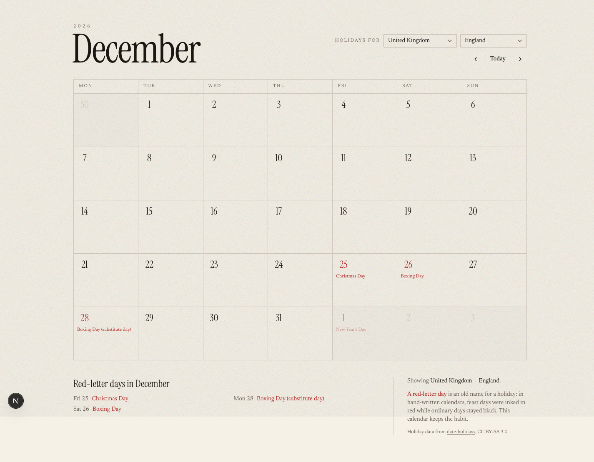
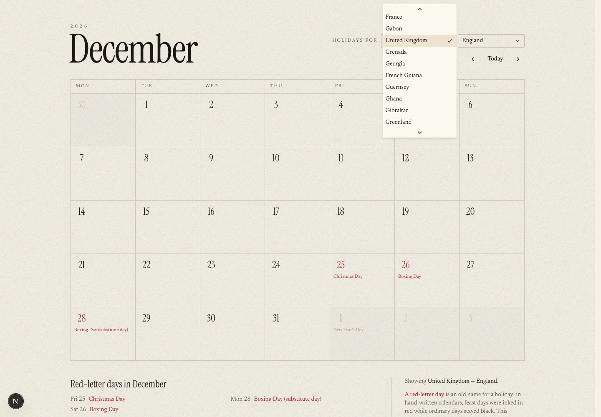
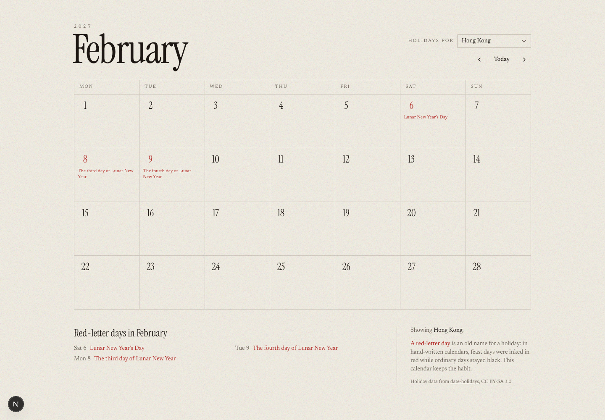

# 9. Add the holidays

Two new ideas: a safe place to try changes, and the difference between code that
runs on the server and code that runs in someone's browser.

---

## The problem with what you have

Right now every push goes straight to the live site. That is fine while nobody
is looking. It stops being fine the moment anyone is.

The fix is a **branch**: a parallel line of work that does not touch `main`
until you say so. Vercel gives every branch its own preview website, so you can
look at the change on a real URL before it becomes the real URL.

```bash
git checkout -b holidays
```

You are now on a branch called `holidays`. `main` is untouched and your live
site is unchanged.

---

## Which source of holiday data?

This is the interesting decision in the chapter, and worth making deliberately
rather than accepting the first suggestion.

Ask:

```
ultrathink — I want public holidays for many countries, with regions
(US states, German Bundesländer). Compare the realistic options: the
date-holidays npm package, the Nager.Date API, and Google's holiday
ICS feeds.

I care about: no API key, works offline while developing, and does not
silently return an empty list for a country it does not support.

Recommend one and tell me the strongest argument against it.
```

For this course the answer was **`date-holidays`**, an npm package. The
reasoning, which is worth understanding because it generalises:

**No network.** Its data is baked into the package. No key, no rate limit, no
outage, and `npm run dev` works on a plane. An API adds a dependency that can be
down at 3am.

**It was measurably more accurate.** Checked against the actual government
sources for 2026 — Japan's Cabinet Office and Hong Kong's official feed — the
package matched Japan **18 out of 18**. The API matched **16 out of 18**: it
omitted Constitution Memorial Day entirely and listed another on the wrong date.
Nothing in the code would have looked wrong. A Japanese user would just have
seen two holidays quietly missing.

**The argument against it**, which is real: the holiday data is frozen into the
version you install. Rules change — countries add days, move substitutes — so an
app left on an old version silently serves last year's rules. A data-bearing
dependency needs updating in a way a code-only one does not.

---

## The trap that justifies the whole exercise

Ask for the feature, and be specific about failure:

```
Add public holidays using date-holidays, with a settings menu to choose
country and region.

Important: check how the library behaves for a country code it does not
support. If it fails silently, wrap it so it fails loudly instead, and
write the test first.
```

Here is what it finds. `new Holidays("XX")` for a nonsense country **does not
throw an error**. It returns an empty list. The calendar renders perfectly, with
no holidays at all — an app that looks healthy and is wrong.

Worse, the library's own `init()` returns `true` for a bogus code, so the
obvious guard does not work either.

The fix is a few lines, and the shape of it is the lesson:

```ts
if (!(country in SUPPORTED_COUNTRIES)) {
  throw new Error(
    `Unknown country code ${JSON.stringify(country)} — expected one of the ` +
      `${Object.keys(SUPPORTED_COUNTRIES).length} supported ISO codes, e.g. "GB", "HK", "US".`,
  );
}
```

**The error names the offending value.** Not "invalid country" — the actual
code that was wrong, and what a right one looks like. That is the difference
between a five-second fix and an afternoon.

> **A rule worth keeping for good:** when something is not recognised, say so
> loudly and show the value. An empty result that means "I did not understand
> you" is the most expensive kind of bug, because it looks like success.
>
> The one exception is anything that might be a password or key — report its
> shape, never its contents.

---

## Server or browser: a decision with a number attached

`date-holidays` carries its whole dataset — every country, every year, plus
timezone and astronomical tables for lunar calendars. About **1.4 MB**.

Where that code runs decides who pays for it.

- **In a server component**, it runs on Vercel's machine. The visitor receives
  the *answer* — a short list of dates — and none of the library.
- **In a browser component**, every visitor downloads all 1.4 MB before the page
  works.

Measured on this project: client JavaScript stayed at **732 KB** with the lookup
on the server, and searching the built files for holiday names found nothing.
The library never crossed over. Adding one line — `"use client"` — to the wrong
file would have taken it past 2 MB.

This is the most concrete explanation of server components you will get:
**the expensive thing stays on the server, and only its answer travels.**

Ask for it explicitly:

```
Compute the holidays in a server component and pass the finished list
down as plain data. Then show me the client bundle size before and
after, and prove no holiday data ended up in it.
```

---

## Where a setting lives

The locale menu needs remembering. Ask which storage to use and you get a real
argument:

**Local storage** is the obvious answer and the wrong one here. The server
cannot read it, so the server would not know which country to compute — forcing
the lookup into the browser, and back comes the 1.4 MB.

**A cookie** is sent with every request, so the server can read it while
rendering. Same "just this browser" limitation, no bundle cost.

The cookie wins. And note the limitation it keeps: **your setting does not
follow you to your phone.** Hold on to that annoyance — chapter 10 is about
fixing exactly that class of problem, and you will appreciate the fix more for
having felt the lack.

One more distinction the assistant should get right, and worth checking:

> A cookie is typed by whoever holds the browser, so a bad one should **fall
> back to the default**. An unknown country passed by *our own code* should
> **throw**. Same wrongness, opposite handling, because one is untrusted input
> and the other is a bug.

---

## Look at it



Two things in that picture are worth pausing on, because both look like bugs and
neither is.

**26 December and 28 December are both marked.** Boxing Day falls on a Saturday
in 2026, so there is the day itself and its substitute weekday. The government's
own list shows only the substitute; the library shows both. Not wrong — a
decision, and one you should make on purpose.

**1 January 2027 is in red, faded, in the December grid.** A month page shows
whole weeks, so December's page runs into January. If the code fetched holidays
only for the year of the month being displayed, that day would silently lose its
red. Catching that needs someone to think about grids that cross New Year — it
is exactly the sort of thing to ask for explicitly:

```
The grid shows days from neighbouring months. Make sure holidays are
fetched for every year the grid touches, and write a test for the
December-into-January case.
```

---

## And the menu





Three things worked correctly there, each of which had to be asked for:

- The **region menu disappeared** for Hong Kong, which has no subdivisions. The
  library returns `undefined` rather than an empty list for those countries, and
  `Object.keys(undefined)` crashes. One `?? {}` prevents it.
- The holidays are **in English**. By default the library answers in the
  country's own language — Hong Kong comes back as 農曆年初一 — which reads as a
  bug to anyone who does not use the script.
- The choice **survived a page reload**, because it is in a cookie.

---

## The safe way to ship it

```bash
git push -u origin holidays
```

Then either open a pull request on GitHub, or let Claude Code do it:

```
Open a pull request for this branch with a description of what changed
and why date-holidays was chosen over the API.
```

Within a minute, Vercel comments on the pull request with a **preview link**.

**Open it.** This is a complete copy of your site, with the change, at its own
address — and your real site is still untouched. Click around. Change country.
Break it if you can.

> If the link shows a Vercel login page, that is the deployment protection from
> chapter 8. It is on by default. Turn it off in project settings if you want to
> show someone.

When you are happy, merge the pull request. Vercel publishes to the real URL
automatically.

```bash
git checkout main
```

```bash
git pull
```

---

## What you actually learned

The holidays are the excuse. The chapter was about three things:

1. **A branch plus a preview link means you never guess.** You look at the
   change, on a real URL, before anyone else can.
2. **Silence is the dangerous failure.** Errors announce themselves; empty lists
   do not. Ask what happens when something is not found, every time.
3. **Where code runs is a decision with a measurable cost.** "Do it on the
   server" is not an abstraction — here it was 1.4 MB per visitor.

---

**Next:** [10. Add a database →](10-appointments-and-a-database.md)
