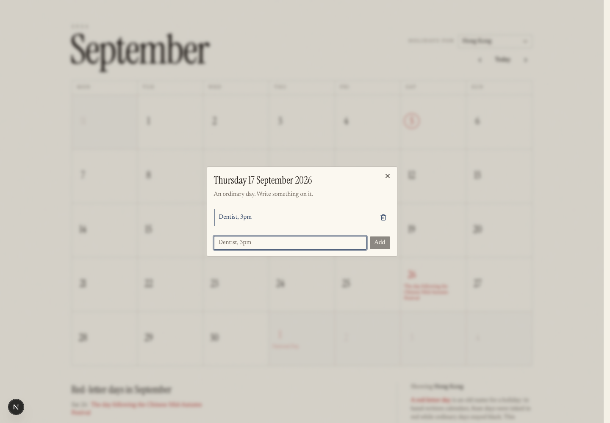

# 10. Add a database

Your locale setting does not follow you to your phone. That is the itch this
chapter scratches, and scratching it properly means learning the three things
that actually matter about databases.

---

## What a database is

You already have somewhere to keep things: files, in GitHub. That works for
*code*, which you write before the app runs.

Appointments are different. They arrive **after** the code is written, from
people who are not you, while the app is running, and they need to be found
again quickly — "everything for this user in this month" out of eventually
rather a lot.

A database is storage built for exactly that: many small records, arriving at
any time, searchable instantly, safe when two people write at once.

Yours is **Postgres**, the most widely used serious database in the world, and
you get it through **Supabase**, which wraps it in a website and handles logins
for you.

The vocabulary is smaller than it looks:

| Word | Means |
|---|---|
| **Table** | A sheet. Ours is `appointments`. |
| **Row** | One record. One appointment. |
| **Column** | One field every row has — `day`, `title`. |
| **Query** | A question. "All appointments for this user in September." |
| **Migration** | A saved instruction that changes the shape of the database. |

---

## Make the project

Go to **[supabase.com](https://supabase.com)** and sign up — GitHub is easiest.

Create a new project. You need a name (`my-calendar`), a database password
(**let it generate one, and let your browser save it**), and a region. Pick the
region nearest your users; it is the physical location of the machine and it
changes how fast the app feels.

It takes a couple of minutes to build.

> **Two limits from chapter 2, now relevant.** The free plan allows **two active
> projects** across everything you own, and pauses a project after about a week
> of no activity. If you already have two, pause an old one rather than deleting
> it — paused projects do not count, and the data survives for a year.

---

## The keys, and the one that must never leak

**Project Settings → API keys.** You will see several, and picking the wrong one
is the most consequential mistake in this chapter.

| Key | Looks like | Where it may go |
|---|---|---|
| **Publishable** | `sb_publishable_Ivvgh…` | Anywhere. It is meant to be public. |
| **Secret** | `sb_secret_LoMan…` | Server only. Never in a browser. Never in git. |
| `anon` / `service_role` | `eyJhbGciOi…` | **The old system.** Do not start here. |

Both systems exist side by side on projects created today, so you have to choose
deliberately. Supabase's own documentation puts it plainly:

> *"If a tool, tutorial, or AI assistant tells you to copy a long key that begins
> with `eyJ`, it was written for the legacy keys."*

The old `anon` and `service_role` keys still work, and are being **retired at the
end of 2026**. Take the `sb_publishable_` one.

**Why the publishable key is safe to publish**, which is genuinely
counter-intuitive: it identifies your project, it does not grant permission.
Permission comes from who is signed in, plus the rules you are about to write.
If those rules are missing, the key is a skeleton key — which is the entire
point of the second half of this chapter.

---

## Put the keys where they belong

In your project, create a file called **`.env.local`**:

```
NEXT_PUBLIC_SUPABASE_URL=https://yourproject.supabase.co
NEXT_PUBLIC_SUPABASE_PUBLISHABLE_KEY=sb_publishable_...
```

Two conventions doing real work here.

**`NEXT_PUBLIC_` means "compile this into the browser".** Anything with that
prefix is baked into the JavaScript every visitor downloads. It is not a
suggestion or a scope — it is genuinely visible to anyone who opens developer
tools.

> **The rule that follows:** a secret key must **never** be in a variable named
> `NEXT_PUBLIC_`. If you ever find `NEXT_PUBLIC_SUPABASE_SECRET_KEY` anywhere,
> that key is public and must be rotated, not renamed.

**`.env.local` is already ignored by git.** Check, rather than trust:

```bash
git check-ignore -v .env.local
```

```
.gitignore:34:.env*	.env.local
```

That is the mechanism, in the open: `create-next-app` wrote a rule matching
`.env*`, so your keys cannot be committed by accident.

That rule is broad, though — it also hides a `.env.example` you *want* shared.
Worth adding:

```
!.env.example
```

And worth verifying, rather than assuming:

```bash
git add -n .env.example    # should say: add '.env.example'
git add -n .env.local      # should refuse
```

**Use the exact variable names above.** The official Supabase code reads
`NEXT_PUBLIC_SUPABASE_PUBLISHABLE_KEY`. Name yours `..._ANON_KEY` and the code
finds `undefined`, and the error surfaces far from the cause.

### And on Vercel

`.env.local` is on your Mac and, correctly, not in git — so Vercel has never
seen it. Add the same two variables at **Project → Settings → Environment
Variables**.

> **Then redeploy.** Environment variables are read at build time; changing one
> does not affect a site that is already built. "I set the key and it still says
> undefined" is almost always this.

---

## The table

Have Claude Code write it as a **migration** — a `.sql` file saved in your
repository, not clicks in a web form:

```
Create an appointments table: an id, the user it belongs to, a day (a
date, not a timestamp), a title, and when it was created. Put it in a
migration file in the repo.

Constrain what you can in the database itself, not just in the app.
```

Why a file rather than the web editor: **a click leaves no trace.** Six months
on, the only record of why a column exists is the schema itself. A migration
file is reviewable, has a commit message, and can be replayed on a fresh
database. It is the same argument as commits, applied to data.

Run it in Supabase's **SQL Editor** — paste from the file, so the file stays the
source of truth.

Two details worth insisting on:

**A `date`, not a timestamp.** An appointment belongs to a square on a page. Make
it a timestamp and you drag timezones into every comparison for no benefit.

**The owner defaults to the signed-in user**, so the browser never sends a user
id — and therefore cannot send someone else's.

---

## The three things a table needs

This is the part to slow down for. Missing any one is a security hole, and only
one of the three announces itself.

### 1. Turn on Row Level Security

```sql
alter table public.appointments enable row level security;
```

Without this, **anyone holding your publishable key can read and write every row
in the table** — and that key is in every visitor's browser by design.

The dangerous detail: **a table created by SQL does not get this automatically.**
Only tables made by clicking in the dashboard's Table Editor do. An AI assistant
writes SQL. So the tool most likely to create your tables is the one that leaves
them open.

### 2. Grant access to the table at all

```sql
grant select, insert, update, delete on public.appointments to authenticated;
```

Separate from RLS, and easy to miss. RLS decides *which rows*; this decides
whether you may touch the table at all. Current Supabase no longer hands these
out automatically, so without it the app fails with:

```
permission denied for table appointments
```

That one is at least loud.

### 3. Write the policies

```sql
create policy "read own appointments"
  on public.appointments for select
  to authenticated
  using ((select auth.uid()) = user_id);

create policy "create own appointments"
  on public.appointments for insert
  to authenticated
  with check ((select auth.uid()) = user_id);
```

Note that the two are not the same word:

- **`using`** picks which existing rows you may see or touch.
- **`with check`** decides which *new* rows you may write.

**Leave `with check` off an insert policy and a signed-in user can create rows
owned by somebody else.** Their appointments appear in your calendar, or yours in
theirs.

> **RLS on with no policies means the table returns nothing.** Your list goes
> empty and it looks broken. It is not — that is default-deny working. The fix
> is policies, never turning RLS back off.

---

## Proving it, instead of believing it

Reading a policy and agreeing that it looks right is not evidence. Ask for the
test:

```
Write a test that signs in as two different users, has the first create
an appointment, and checks the second cannot read it, edit it, delete it,
or create a row owned by the first.

Then prove the test works: turn RLS off, show me it failing, turn it back on.
```

With RLS on, eight tests pass. With RLS switched off, four of them fail:

```
× hides Alice's appointment from Bob
× refuses to let Bob create a row owned by Alice
× refuses to let Bob delete Alice's appointment
× refuses to let Bob edit Alice's appointment

AssertionError: expected [ { …(6) } ] to deeply equal []
AssertionError: expected [] to have a length of 1 but got +0
```

Read that second message. Alice's appointment was **length 1**, and after Bob
deleted it, **length 0**. With one line of SQL missing, a stranger destroyed
another person's data.

**That is what a security test is for.** Not to prove the code works — to show
you exactly what it costs when it does not. A control you have never seen fail
is a control you merely believe in.

---

## Who is "signed in", without a login form

The policies rest on `auth.uid()`, so there must be a user. Building a whole
sign-up flow is a chapter of its own, so use **anonymous sign-in**: on first
visit, the browser is quietly issued a real user identity, with no form.

```ts
const { data } = await supabase.auth.getSession();
if (!data.session) {
  await supabase.auth.signInAnonymously();
}
```

It is a genuine user row, so `auth.uid()` and every policy work exactly as they
will with real logins. Swapping in email or Google later changes this one call
and nothing else.

Its honest limitation: the identity lives in that browser. Clear your browser
data and the appointments are gone — still there in the database, but no longer
yours. That is the argument for real accounts, when you want one.

---

## The result




Holidays in red, your own appointments in ink blue, and on the 26th both at
once. Reload the page and they are still there, because they are in Postgres
rather than in the tab.

---

## The thing that should feel strange

The browser talks **straight to the database.** There is no API of yours in
between — no server code you wrote checking whether this person may read this
row.

That should feel reckless, and it would be, except that Row Level Security is
doing that job *inside the database*, where it cannot be bypassed by anyone who
gets clever with the browser.

This is why the tests in this chapter matter more than any others in the course.
The rule is the only thing standing between your users and each other, so it is
the thing most worth proving rather than assuming.

---

## Commit, push, check

```
Run the build and all the tests, commit, and push. Then remind me what
I need to set on Vercel for this to work in production.
```

The answer to that last part is the two environment variables — **and a
redeploy**.

---

**Next:** [11. Staying maintainable →](11-staying-maintainable.md)
